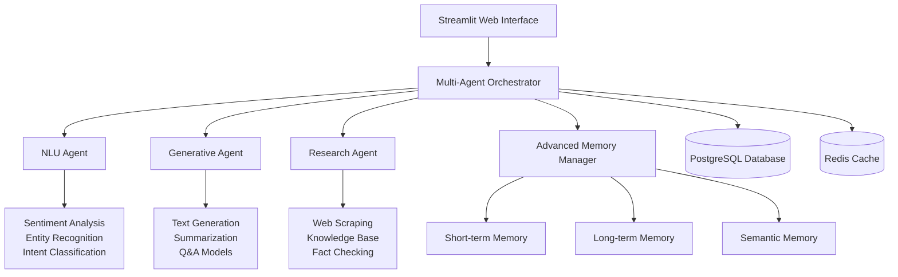

# AI_Multi-Agent_Research_Assistant
# 🤖 AI Multi-Agent Research Assistant

> **Advanced AI system combining Natural Language Processing, Generative AI, and Multi-Agent Intelligence for comprehensive research and analysis**

## 🌟 Features

### 🧠 **Multi-Agent Intelligence**
- **NLU Agent**: Advanced natural language understanding with sentiment analysis, entity extraction, and intent classification
- **Generative Agent**: Text generation, summarization, question answering, and creative writing
- **Research Agent**: Web scraping, knowledge synthesis, fact-checking, and trend analysis

### 🚀 **Advanced Capabilities**
- **Sophisticated Memory Management**: Hierarchical memory with short-term, long-term, and semantic storage
- **Intelligent Orchestration**: Dynamic agent selection and coordination strategies
- **Real-time Analytics**: Performance monitoring, success rate tracking, and comprehensive dashboards
- **Professional UI**: Modern Streamlit interface with advanced features and visualizations

### 🔬 **Research & Analysis**
- Multi-source web research with credibility scoring
- Automated fact-checking with evidence aggregation
- Trend analysis with statistical modeling
- Knowledge synthesis from multiple sources
- Source validation and confidence assessment

### 📊 **Data & Visualization**
- Interactive charts and graphs
- Real-time performance metrics
- Conversation analytics
- Export capabilities for reports
- Advanced data processing tools

## 🏗️ Architecture

